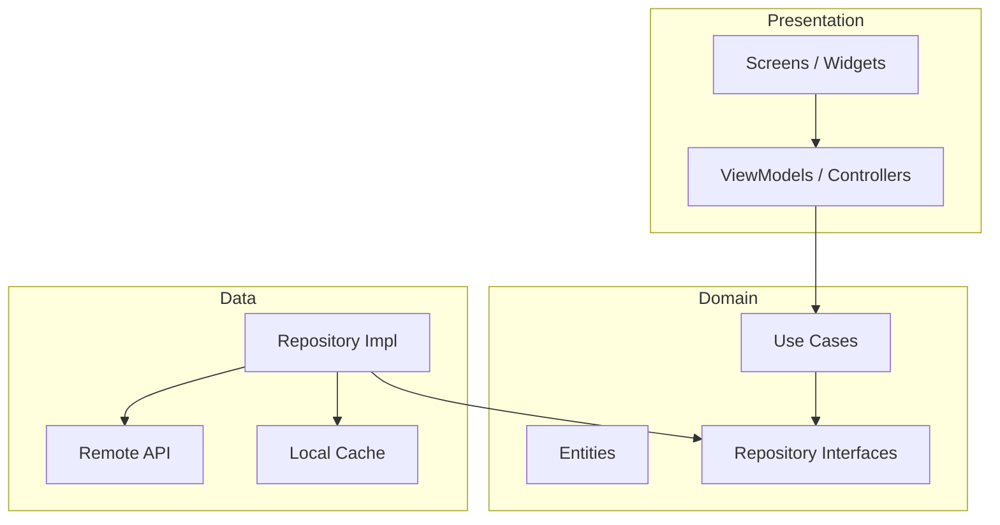
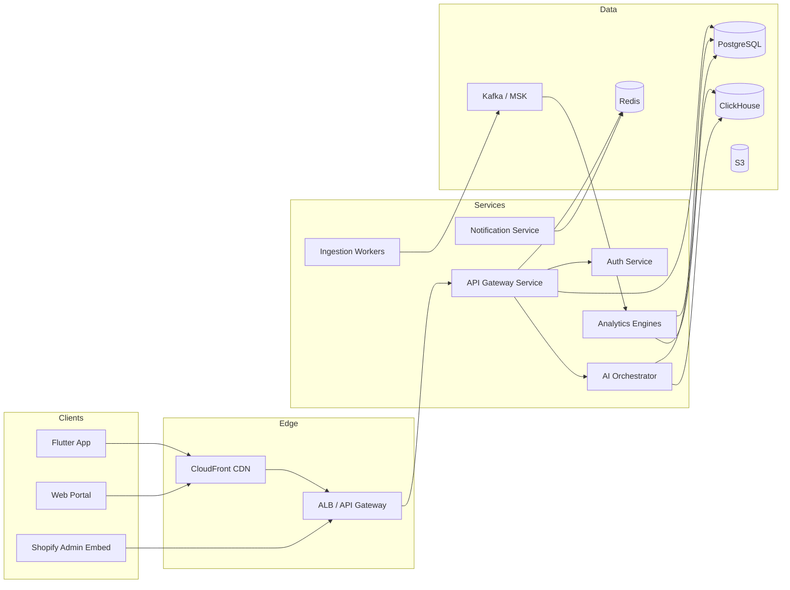
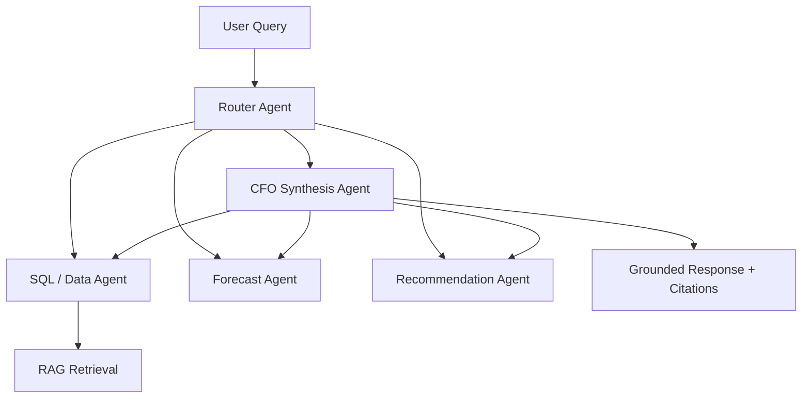
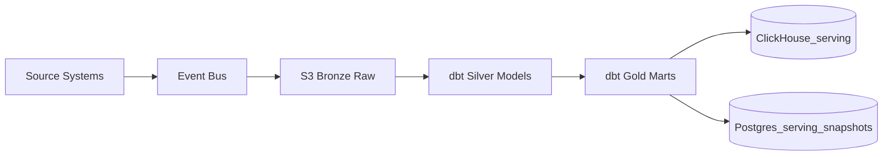
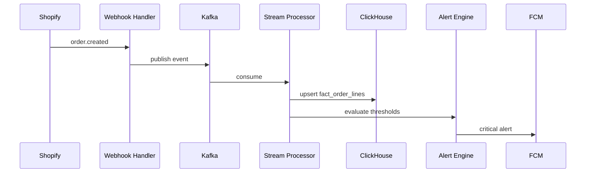
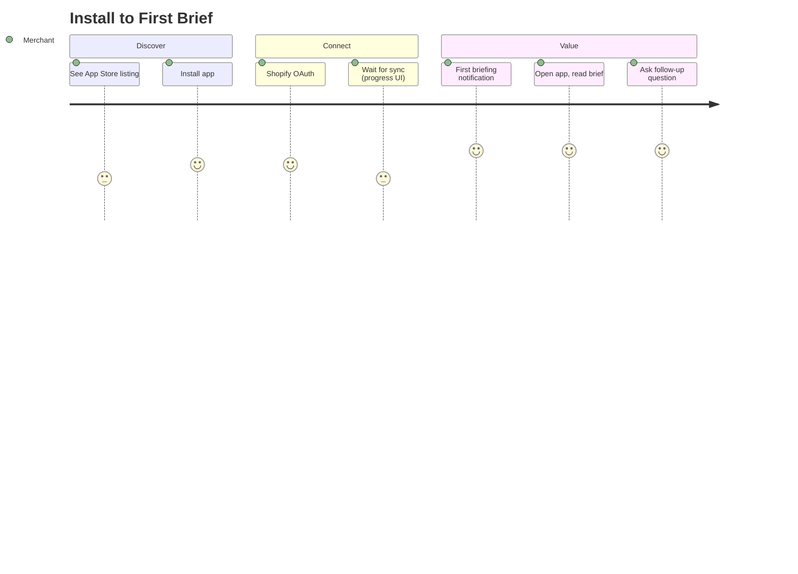
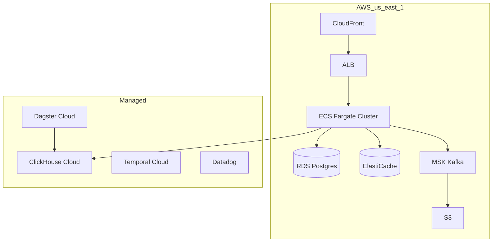
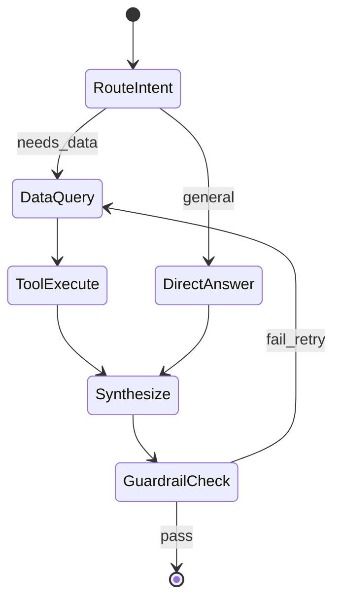
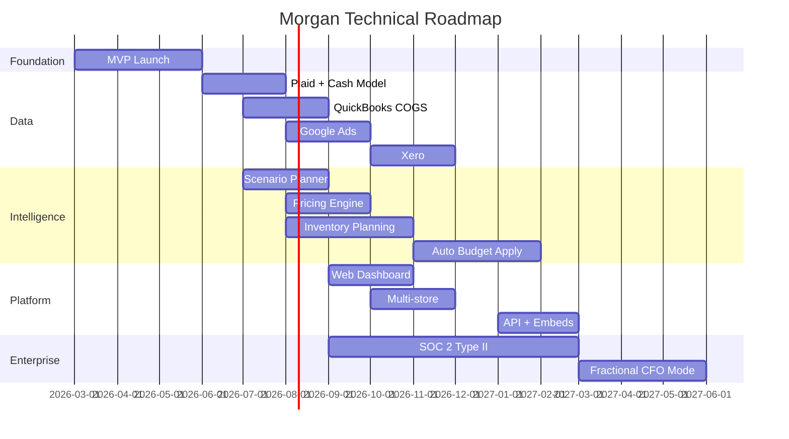

# Morgan — Founding CTO Blueprint

> **Category:** AI-native financial intelligence for e-commerce merchants  
> **Mission:** Act as an AI Chief Financial Officer — not accounting, not dashboards — answering *what happened, why, what to do next, what risks exist, and where profit hides.*  
> **Primary wedge:** Shopify merchants ($100K–$10M GMV)  
> **Design principles:** Simplicity first, speed to market, scalable by default

---

## Table of Contents

1. [Product Vision](#1-product-vision)
2. [Core User Personas](#2-core-user-personas)
3. [Jobs To Be Done](#3-jobs-to-be-done)
4. [Product Requirements Document](#4-product-requirements-document-prd)
5. [Complete Feature Specification](#5-complete-feature-specification)
6. [Mobile App Architecture](#6-mobile-app-architecture)
7. [Backend Architecture](#7-backend-architecture)
8. [AI Agent Architecture](#8-ai-agent-architecture)
9. [Data Warehouse Design](#9-data-warehouse-design)
10. [Database Schema](#10-database-schema)
11. [API Design](#11-api-design)
12. [Shopify Integration Strategy](#12-shopify-integration-strategy)
13. [Open Banking Integration Strategy](#13-open-banking-integration-strategy)
14. [Meta Ads Integration Strategy](#14-meta-ads-integration-strategy)
15. [Google Ads Integration Strategy](#15-google-ads-integration-strategy)
16. [QuickBooks Integration Strategy](#16-quickbooks-integration-strategy)
17. [Xero Integration Strategy](#17-xero-integration-strategy)
18. [Real-Time Event Architecture](#18-real-time-event-architecture)
19. [Forecasting Engine Design](#19-forecasting-engine-design)
20. [Recommendation Engine Design](#20-recommendation-engine-design)
21. [Profit Leak Detection Engine](#21-profit-leak-detection-engine)
22. [Inventory Planning Engine](#22-inventory-planning-engine)
23. [Pricing Optimization Engine](#23-pricing-optimization-engine)
24. [Marketing Budget Allocation Engine](#24-marketing-budget-allocation-engine)
25. [Morgan Chat Design](#25-morgan-chat-design)
26. [Daily Briefing System](#26-daily-briefing-system)
27. [Notification System](#27-notification-system)
28. [User Journey Maps](#28-user-journey-maps)
29. [Wireframes for Every Screen](#29-wireframes-for-every-screen)
30. [Flutter Mobile App Structure](#30-flutter-mobile-app-structure)
31. [Backend Services and Microservices](#31-backend-services-and-microservices)
32. [Cloud Infrastructure Design](#32-cloud-infrastructure-design)
33. [Security and Compliance Requirements](#33-security-and-compliance-requirements)
34. [Data Privacy Requirements](#34-data-privacy-requirements)
35. [AI Model Strategy](#35-ai-model-strategy)
36. [LLM Orchestration Strategy](#36-llm-orchestration-strategy)
37. [MVP Scope](#37-mvp-scope)
38. [90-Day Development Plan](#38-90-day-development-plan)
39. [Technical Roadmap](#39-technical-roadmap)
40. [Go-To-Market Strategy](#40-go-to-market-strategy)
41. [Pricing Strategy](#41-pricing-strategy)
42. [Monetization Strategy](#42-monetization-strategy)
43. [Competitive Analysis](#43-competitive-analysis)
44. [Moat and Defensibility Strategy](#44-moat-and-defensibility-strategy)
45. [Path to $1M ARR](#45-path-to-1m-arr)
46. [Path to $10M ARR](#46-path-to-10m-arr)
47. [Path to $100M ARR](#47-path-to-100m-arr)

---

## 1. Product Vision

### One-liner
**Morgan is the decision layer for e-commerce finance** — a mobile-first AI that turns fragmented store, ad, bank, and accounting data into daily actions that increase profit and reduce cash risk.

### Vision statement
Every Shopify merchant deserves a world-class CFO. Today only brands above $50M can afford one. Morgan democratizes financial judgment: proactive briefings, explainable recommendations, and closed-loop outcomes — without replacing QuickBooks or becoming another BI dashboard.

### What we are NOT
| Not this | Why |
|----------|-----|
| Accounting software | Commoditized; merchants already have QBO/Xero |
| Reporting dashboard | Merchants drown in charts; they need decisions |
| Bookkeeping service | Low margin, human-heavy, doesn't scale |
| Generic AI chatbot | Must be grounded in *their* financial truth |

### North-star metric
**Profit influenced per merchant per month** — $ recovered from leaks + $ gained from accepted recommendations, attributed within 30 days.

### Strategic pillars
1. **Decision-first UX** — Every surface ends in an action
2. **Unified financial graph** — Orders, COGS, ads, cash, inventory as one model
3. **Proactive intelligence** — Push insights before merchants ask
4. **Trust through explainability** — Show the math, cite the data source
5. **Mobile-native** — CFO in your pocket at 7am, not a desktop report at 7pm

### Synergy with OctoPing (optional portfolio play)
OctoPing owns **revenue recovery** (cart abandonment, winback). Morgan owns **profit optimization** (margin, cash, spend allocation). Shared Shopify OAuth, merchant identity, and attribution infrastructure accelerate both products without merging positioning.

---

## 2. Core User Personas

### Persona A: **Solo Operator Sam** (Primary MVP)
- **Profile:** $300K–$1.5M GMV, 1–3 person team, runs ads themselves
- **Pain:** Doesn't know true margin per SKU; cash feels tight despite sales growth
- **Behavior:** Checks Shopify app on phone; ignores spreadsheets
- **Willingness to pay:** $99–$199/mo if it saves one bad inventory buy
- **Success:** "I know what to do today in 2 minutes"

### Persona B: **Growth Operator Grace**
- **Profile:** $2M–$8M GMV, small finance/ops hire, Meta + Google ads
- **Pain:** ROAS looks good but profit doesn't; inventory stockouts vs overstock
- **Behavior:** Weekly finance review; uses QBO; wants board-ready numbers
- **Willingness to pay:** $299–$499/mo
- **Success:** "I reallocated $15K ad spend and margin went up 4 points"

### Persona C: **Multi-Brand Marcus**
- **Profile:** 2–4 Shopify stores, agency for ads, bookkeeper for books
- **Pain:** No consolidated cash view; each store is a black box
- **Willingness to pay:** $499–$999/mo
- **Success:** Portfolio-level daily briefing

### Persona D: **CFO-for-hire Fiona** (Year 2+)
- **Profile:** Fractional CFO serving 5–15 Shopify brands
- **Pain:** Manual client reporting; no standardized e-com unit economics
- **Willingness to pay:** $149/brand/mo white-label
- **Success:** Multi-tenant command center

### Anti-persona
Enterprise retailers with SAP, dedicated FP&A teams, and custom data lakes — wrong ICP for years 1–3.

---

## 3. Jobs To Be Done

| Job | Functional | Emotional | Social |
|-----|------------|-----------|--------|
| **Morning clarity** | Know if yesterday was good or bad | Feel in control, not anxious | Look competent to team/partner |
| **Diagnose profit drops** | Find root cause (ads, returns, COGS, shipping) | Stop panic spiral | Explain to stakeholders with confidence |
| **Allocate marketing spend** | Shift budget to profitable channels/SKUs | Confidence in ad decisions | Justify spend to co-founder |
| **Plan inventory buys** | Order right quantity at right time | Avoid cash trap of dead stock | Not disappoint customers with stockouts |
| **Manage cash runway** | Predict when cash gets tight | Sleep at night | Avoid awkward vendor conversations |
| **Price correctly** | Adjust prices without killing conversion | Feel smart, not greedy | Match competitors intelligently |
| **Prepare for growth** | Know if they can afford hiring/inventory | Excitement without recklessness | Investor/lender readiness |

### Core JTBD statement
> *When my store's finances feel opaque, help me understand what happened, why, and what to do next — so I can grow profitably without hiring a CFO.*

---

## 4. Product Requirements Document (PRD)

### 4.1 Problem
Shopify merchants operate across 5–8 disconnected systems (Shopify, Meta, Google, bank, QBO, spreadsheets). No system answers causal financial questions or recommends specific actions with expected dollar impact.

### 4.2 Solution
Mobile-first Morgan that:
1. Ingests commerce + ads + cash + accounting data
2. Builds merchant-specific unit economics and cash model
3. Surfaces daily briefings, alerts, and chat grounded in their data
4. Proposes ranked actions with confidence and impact ranges

### 4.3 Goals (12 months)
| Goal | Target |
|------|--------|
| Shopify App Store launch | Month 3 |
| Paying merchants | 500 |
| MRR | $75K |
| D7 retention | >60% |
| Recommendation acceptance rate | >25% |
| Attributed profit influence | $2M cumulative |

### 4.4 Non-goals (Year 1)
- Full GL / bookkeeping
- Tax filing
- Invoice AP/AR management
- Custom BI builder
- Non-Shopify platforms (WooCommerce Phase 2)

### 4.5 User stories (priority)

**P0 — MVP**
- As a merchant, I connect Shopify and see a daily briefing within 24h
- As a merchant, I ask "why did profit drop yesterday?" and get a cited answer
- As a merchant, I receive alerts for cash risk and margin compression
- As a merchant, I see top 3 recommended actions with $ impact

**P1 — Growth**
- Connect Meta Ads and see blended MER/POAS
- Connect bank (Plaid) for cash runway forecast
- Connect QuickBooks for COGS reconciliation
- Accept/dismiss recommendations; track outcomes

**P2 — Scale**
- Google Ads, Xero, multi-store, team seats, API export

### 4.6 Success metrics
| Metric | Definition |
|--------|------------|
| TTV (time to value) | <24h from install to first briefing |
| WAU/MAU | >0.55 |
| Briefing open rate | >70% |
| Chat sessions/week | >2 per active merchant |
| NPS | >45 |

---

## 5. Complete Feature Specification

### 5.1 Feature map

```
┌─────────────────────────────────────────────────────────────┐
│                      MORGAN PLATFORM                        │
├──────────────┬──────────────┬──────────────┬───────────────┤
│   INGEST     │   MODEL      │  INTELLIGENCE │   DELIVERY    │
├──────────────┼──────────────┼──────────────┼───────────────┤
│ Shopify      │ Unit Econ    │ Daily Brief  │ Mobile App    │
│ Meta Ads     │ Cash Model   │ AI Chat      │ Push Notifs   │
│ Google Ads   │ Forecasts    │ Rec Engine   │ Email Digest  │
│ Plaid/Bank   │ Profit Leaks │ 5 Engines    │ Shopify Embed │
│ QBO/Xero     │ Inventory    │ Risk Scores  │ Web Dashboard │
└──────────────┴──────────────┴──────────────┴───────────────┘
```

### 5.2 Module specifications

#### A. Home / Daily Brief
- **Inputs:** Last 24h orders, ad spend, refunds, inventory deltas, cash position
- **Outputs:** 60-second narrative, 3 KPI tiles, 1–3 action cards
- **Refresh:** 6am merchant local time + on significant event

#### B. Ask Morgan (Chat)
- **Scope:** Natural language Q&A over merchant financial graph
- **Guardrails:** Refuse tax/legal advice; cite sources; show confidence
- **Tools:** SQL agent, calculator, scenario simulator

#### C. Profit Dashboard (not a BI tool)
- **Shows:** Contribution margin trend, MER, cash runway, leak count
- **Interaction:** Tap any metric → "why" explanation → recommended action

#### D. Recommendations Feed
- **Card fields:** Title, impact ($ range), effort, confidence, deadline, accept/dismiss
- **Categories:** Pricing, inventory, ads, costs, cash

#### E. Alerts
- **Types:** Cash crunch, margin drop, ad waste, stockout risk, refund spike
- **Severity:** Info / Warning / Critical

#### F. Integrations Hub
- Connection status, last sync, data coverage %, reconnect flows

#### G. Settings
- COGS method (Shopify cost / QBO / manual %), timezone, notification prefs, team

#### H. Scenario Planner (P1)
- "What if I increase Meta spend 20%?" → projected profit/cash impact

---

## 6. Mobile App Architecture

### 6.1 Stack
| Layer | Technology | Rationale |
|-------|------------|-----------|
| Framework | **Flutter 3.x** (Dart) | Single codebase iOS/Android; fast UI; good offline |
| State | **Riverpod 2** | Testable; scales with feature modules |
| Navigation | **go_router** | Deep links from push notifications |
| API client | **dio** + generated OpenAPI client | Type-safe; matches backend spec |
| Local cache | **Hive** + **flutter_secure_storage** | Offline briefings; token security |
| Auth | **Shopify OAuth** → JWT | Merchants already trust Shopify install |
| Push | **Firebase Cloud Messaging** | Industry standard |
| Analytics | **PostHog Flutter** | Product analytics + feature flags |
| Charts | **fl_chart** | Lightweight; mobile-optimized |

### 6.2 Architecture pattern: Clean Architecture + Feature Modules



### 6.3 Offline strategy
- Cache last 7 daily briefings + last 50 recommendations
- Queue chat messages; show "connecting" state
- Sync on app resume via background fetch (iOS) / WorkManager (Android)

### 6.4 Performance targets
- Cold start: <2s
- Briefing render: <500ms (cached), <2s (network)
- Chat first token: <1.5s (streaming)

---

## 7. Backend Architecture

### 7.1 High-level



### 7.2 Core stack
| Component | Technology | Rationale |
|-----------|------------|-----------|
| API runtime | **Node.js 24 + TypeScript** | Matches OctoPing; fast iteration; Shopify ecosystem |
| API framework | **Fastify** | Performance; schema validation |
| ORM | **Drizzle ORM** | Type-safe; lightweight (already in OctoPing) |
| Job queue | **BullMQ + Redis** | Simple; proven; upgrade to Temporal at scale |
| Event bus | **AWS MSK (Kafka)** or **Redpanda** | Durable event log for integrations |
| Workflow (later) | **Temporal Cloud** | Long-running syncs, retries |
| Search | **PostgreSQL FTS** → **Typesense** at scale | Merchant-scoped chat history |

### 7.3 Monolith-first, extract later
**MVP:** Single `api_server` deployable (pattern from OctoPing) with modular packages:
- `@morgan/db`
- `@morgan/integrations`
- `@morgan/engines`
- `@morgan/ai-orchestrator`

Extract microservices when a module hits independent scaling needs (AI orchestrator first).

---

## 8. AI Agent Architecture

### 8.1 Agent topology



### 8.2 Agent responsibilities

| Agent | Role | Tools |
|-------|------|-------|
| **Router** | Classify intent; pick agents | Intent taxonomy |
| **SQL Agent** | Query ClickHouse/Postgres safely | Parameterized queries, row limits |
| **Forecast Agent** | Run Prophet/ARIMA scenarios | Time-series API |
| **Recommendation Agent** | Rank actions from engine outputs | Engine APIs |
| **CFO Synthesis** | Natural language answer with citations | All above + merchant context |
| **Guardrail Agent** | PII redaction, compliance, hallucination check | Policy rules |

### 8.3 Context assembly (per request)
1. Merchant profile (COGS method, timezone, integrations)
2. Precomputed metrics (last 30/90 days)
3. Active recommendations + recent alerts
4. Retrieved facts from vector store (past briefings, notes)
5. Tool results with source timestamps

### 8.4 Safety
- **No autonomous money movement** in MVP — recommend only
- SQL agent: read-only replica; merchant_id mandatory filter
- All numeric claims must trace to `metric_id` or `query_hash`

---

## 9. Data Warehouse Design

### 9.1 Architecture: ELT with ClickHouse



### 9.2 Warehouse technology
| Layer | Tech | Why |
|-------|------|-----|
| Raw storage | **S3** | Cheap; immutable audit |
| Transform | **dbt Core** on **Dagster** | SQL transforms; testable |
| Serving OLAP | **ClickHouse Cloud** | Fast aggregations; cost-effective at scale |
| Orchestration | **Dagster Cloud** | Asset lineage; backfills |

### 9.3 Gold-layer marts (core)

| Mart | Grain | Key metrics |
|------|-------|-------------|
| `mart_orders_daily` | store × day | net revenue, COGS, contribution margin |
| `mart_sku_economics` | store × sku × week | unit margin, velocity, return rate |
| `mart_ad_performance` | store × channel × campaign × day | spend, attributed revenue, POAS |
| `mart_cash_daily` | store × day | balance, inflows, outflows, runway days |
| `mart_inventory_health` | store × sku × day | days of stock, overstock $, stockout risk |
| `mart_profit_leaks` | store × leak × day | leak type, $ at risk |
| `mart_recommendations` | recommendation_id | impact, status, outcome |

### 9.4 Refresh cadence
| Data | Latency |
|------|---------|
| Orders (webhook) | <5 min |
| Ads (API poll) | 1–4 hours |
| Bank (Plaid) | 4–12 hours |
| QBO/Xero | Daily |
| Gold marts | Hourly + on-demand for chat |

---

## 10. Database Schema

### 10.1 OLTP (PostgreSQL) — core tables

```sql
-- Tenancy
organizations (id, name, plan_tier, created_at)
users (id, org_id, email, role, created_at)
stores (id, org_id, platform, shop_domain, timezone, currency, status)

-- Integrations
integrations (id, store_id, provider, status, scopes, connected_at, last_sync_at)
integration_credentials (id, integration_id, encrypted_payload, expires_at)
sync_runs (id, integration_id, status, records_processed, error, started_at, finished_at)

-- Merchant config
merchant_finance_config (
  store_id PK, cogs_method ENUM('shopify','qbo','manual_pct'),
  manual_cogs_pct, fiscal_year_start, notification_prefs JSONB
)

-- Intelligence outputs (serving layer)
daily_briefings (id, store_id, briefing_date, summary_json, narrative_text, created_at)
recommendations (
  id, store_id, engine, category, title, body,
  impact_low_usd, impact_high_usd, confidence, effort,
  status ENUM('open','accepted','dismissed','expired'),
  expires_at, created_at
)
alerts (id, store_id, severity, type, title, body, metric_snapshot JSONB, read_at, created_at)
metric_snapshots (id, store_id, metric_key, value, period, as_of, source)

-- Chat
chat_sessions (id, store_id, user_id, created_at)
chat_messages (id, session_id, role, content, citations JSONB, created_at)

-- Attribution / outcomes
recommendation_outcomes (
  id, recommendation_id, measured_impact_usd, measurement_window_days, recorded_at
)

-- Billing
subscriptions (id, org_id, stripe_subscription_id, plan, status, current_period_end)
```

### 10.2 ClickHouse — example fact table

```sql
CREATE TABLE fact_order_lines (
  store_id UUID,
  order_id String,
  line_id String,
  sku String,
  quantity Int32,
  gross_revenue Decimal(18,4),
  discount Decimal(18,4),
  cogs Decimal(18,4),
  shipping_allocated Decimal(18,4),
  payment_fees Decimal(18,4),
  contribution_margin Decimal(18,4),
  ordered_at DateTime,
  _ingested_at DateTime DEFAULT now()
) ENGINE = MergeTree()
PARTITION BY toYYYYMM(ordered_at)
ORDER BY (store_id, ordered_at, sku);
```

### 10.3 Indexing strategy
- Postgres: `(store_id, created_at DESC)` on all store-scoped tables
- ClickHouse: partition by month; order by store_id + time

---

## 11. API Design

### 11.1 Principles
- REST + JSON; OpenAPI 3.1 spec; Orval-generated clients (OctoPing pattern)
- Version prefix: `/api/v1`
- Auth: Bearer JWT (Shopify session token exchange for embedded; email/password or magic link for mobile)
- All resources scoped: `/stores/{storeId}/...`

### 11.2 Core endpoints

| Method | Path | Description |
|--------|------|-------------|
| POST | `/auth/shopify/token-exchange` | Shopify session → JWT |
| GET | `/stores` | List merchant stores |
| GET | `/stores/{id}/briefing/today` | Today's daily brief |
| GET | `/stores/{id}/briefing/{date}` | Historical brief |
| GET | `/stores/{id}/metrics` | KPI tiles with trends |
| GET | `/stores/{id}/recommendations` | Paginated recommendations |
| POST | `/stores/{id}/recommendations/{id}/accept` | Accept action |
| POST | `/stores/{id}/recommendations/{id}/dismiss` | Dismiss with reason |
| GET | `/stores/{id}/alerts` | Alerts feed |
| POST | `/stores/{id}/chat/sessions` | New chat session |
| POST | `/stores/{id}/chat/sessions/{id}/messages` | Send message (SSE stream) |
| GET | `/stores/{id}/integrations` | Integration status |
| POST | `/stores/{id}/integrations/shopify/connect` | OAuth start |
| POST | `/stores/{id}/integrations/plaid/link-token` | Plaid Link token |
| GET | `/stores/{id}/scenarios` | List saved scenarios |
| POST | `/stores/{id}/scenarios/run` | Run what-if scenario |

### 11.3 Webhooks (inbound)
- `POST /webhooks/shopify` — orders, products, inventory, app uninstall
- `POST /webhooks/stripe` — billing events
- `POST /webhooks/plaid` — transaction updates

### 11.4 Streaming chat (SSE)
```
POST /stores/{id}/chat/sessions/{sid}/messages
Accept: text/event-stream

event: token
data: {"text":"Your"}

event: citation
data: {"source":"mart_orders_daily","date":"2026-06-14","metric":"contribution_margin"}

event: done
data: {"message_id":"..."}
```

---

## 12. Shopify Integration Strategy

### 12.1 App type
**Public embedded app** + **mobile deep link** — Shopify App Store as primary distribution (proven by OctoPing).

### 12.2 OAuth scopes (minimal viable → expanded)

**MVP scopes:**
```
read_orders, read_products, read_inventory, read_locations,
read_shopify_payments_payouts, read_customers
```

**Phase 2:**
```
read_discounts, read_shipping, read_returns, read_markets
```

### 12.3 Data ingestion

| Method | Data | Frequency |
|--------|------|-----------|
| Webhooks | orders/create, orders/updated, refunds, products/update, inventory_levels/update | Real-time |
| Bulk Operations (GraphQL) | Historical orders (90d), products, inventory | On connect + weekly |
| Admin GraphQL polling | Payouts, shop metadata | Daily |

### 12.4 Key GraphQL queries
- `orders` with line items, discounts, shipping lines, transactions
- `products` → variants → `inventoryItem.unitCost` (COGS)
- `shopifyPaymentsAccount` → balance and payouts

### 12.5 Shopify Billing
Use **Shopify Billing API** (recurring application charge) for App Store merchants — reduces friction vs external Stripe checkout.

### 12.6 Compliance
- GDPR webhooks: `customers/data_request`, `customers/redact`, `shop/redact` (OctoPing already implements)
- HMAC verification on all webhooks

### 12.7 Implementation reuse from OctoPing
Leverage existing patterns: `shopifyTokenExchange`, continuous sync, compliance webhooks, scope management — swap product surface, extend scopes for inventory/payouts.

---

## 13. Open Banking Integration Strategy

### 13.1 Provider: **Plaid** (US/CA) + **TrueLayer** (UK/EU expansion)

**Why Plaid first:** Fastest US merchant coverage; stable Shopify merchant overlap; Plaid Transactions + Balance + Recurring Transactions.

### 13.2 Connection flow
1. Mobile: `POST /integrations/plaid/link-token` → Plaid Link SDK (Flutter: `plaid_flutter`)
2. Exchange public token → encrypted store in `integration_credentials`
3. Initial 24-month transaction pull; then sync via Plaid Transactions Sync API

### 13.3 Cash model inputs
- Daily balance snapshots
- Categorized inflows (deposits, Shopify payouts, refunds)
- Outflows (ad spend charges, COGS payments, payroll, SaaS)
- Recurring transaction detection → fixed cost baseline

### 13.4 Matching logic
- Fuzzy match Shopify payout deposits to bank inflows (amount + 1–3 day window)
- Unmatched transactions → merchant categorization prompt (one-time UX)

### 13.5 Risk outputs
- Cash runway (days until $0 at current burn)
- Payout delay detection
- Overdraft risk score

### 13.6 Compliance
- Plaid end-user privacy policy disclosure
- Store only transaction metadata needed; no credential storage
- SOC 2 alignment via Plaid's compliance program

---

## 14. Meta Ads Integration Strategy

### 14.1 API: **Meta Marketing API** (Facebook Graph API v19+)

### 14.2 Auth
- OAuth via Facebook Login for Business
- Permissions: `ads_read`, `ads_management` (read-only in MVP; management in Phase 2 for budget shift suggestions)

### 14.3 Data pulled
| Level | Fields |
|-------|--------|
| Account | spend, impressions, clicks |
| Campaign | name, status, daily_budget, spend, purchases (pixel), ROAS |
| Ad set | targeting summary, spend |
| Ad | creative ID, spend |

### 14.4 Attribution bridge
- Import UTM-tagged order revenue from Shopify (`utm_source=facebook`)
- Compute **POAS** (Profit on Ad Spend) not just ROAS:
  `POAS = (contribution_margin from Meta-attributed orders) / ad_spend`

### 14.5 Sync cadence
- Every 4 hours via async job
- Rate limit: batch insights requests; use `date_preset=yesterday` for daily rollups

### 14.6 Recommendations enabled
- Pause campaigns with POAS < 1.0 for 7 days
- Reallocate budget to top POAS campaigns (suggestion only in MVP)

---

## 15. Google Ads Integration Strategy

### 15.1 API: **Google Ads API** (REST + GAQL)

### 15.2 Auth
- OAuth 2.0 with `https://www.googleapis.com/auth/adwords` scope
- Developer token required (apply early — 2–4 week approval)

### 15.3 Data pulled
- Campaign / ad group performance: cost, conversions, conversion value
- Shopping campaigns: product-level performance (P1)

### 15.4 Integration timing
**Phase 2 (post-MVP)** — Meta covers 80% of Shopify ad spend; Google adds incrementality for Growth Operator Grace persona.

### 15.5 POAS computation
Same UTM + gclid matching pattern as Meta; Google click ID stored in Shopify order note attributes when available.

---

## 16. QuickBooks Integration Strategy

### 16.1 API: **QuickBooks Online API** (Intuit OAuth 2.0)

### 16.2 Purpose (not bookkeeping)
- Import **COGS**, **operating expenses**, **vendor bills** for true margin
- Reconcile Shopify revenue vs QBO deposits
- Validate AI recommendations against actual books

### 16.3 Data entities
| Entity | Use |
|--------|-----|
| Profit & Loss report | Monthly opex baseline |
| Bills / Purchases | COGS validation |
| Deposits | Cash reconciliation |
| Chart of Accounts | Expense categorization |

### 16.4 Sync
- Daily pull via QBO Reports API + Change Data Capture for transactions
- Map accounts → Morgan cost categories (configurable mapping UI)

### 16.5 Conflict resolution
If QBO COGS conflicts with Shopify `unitCost`: default to QBO for margin; flag discrepancy >5%.

---

## 17. Xero Integration Strategy

### 17.1 API: **Xero Accounting API** (OAuth 2.0)

### 17.2 Timing
Phase 2 — parallel to QBO for UK/AU/NZ merchants (large Shopify markets).

### 17.3 Data parity with QBO
- P&L, bank transactions, invoices, contacts
- Same cost category mapping layer (provider-agnostic abstraction)

### 17.4 Abstraction layer
```typescript
interface AccountingProvider {
  fetchPnL(storeId, period): Promise<PnLReport>
  fetchExpenses(storeId, period): Promise<Expense[]>
  fetchDeposits(storeId, period): Promise<Deposit[]>
}
// Implementations: QuickBooksProvider, XeroProvider
```

---

## 18. Real-Time Event Architecture

### 18.1 Event envelope

```json
{
  "event_id": "uuid",
  "event_type": "order.created",
  "store_id": "uuid",
  "source": "shopify",
  "occurred_at": "2026-06-15T10:00:00Z",
  "payload": {},
  "schema_version": 1
}
```

### 18.2 Pipeline



### 18.3 Technology
| Component | Tech |
|-----------|------|
| Event bus | AWS MSK (Kafka) |
| Stream processing | Node consumers (MVP) → Flink or ksqlDB at scale |
| Dead letter | S3 + replay tooling |
| Idempotency | `event_id` dedup in Redis (24h TTL) |

### 18.4 Real-time triggers
- Refund >$X or refund rate spike → alert
- Order velocity anomaly → briefing update
- Inventory below safety stock → recommendation

---

## 19. Forecasting Engine Design

### 19.1 Purpose
Predict revenue, cash, inventory demand, and ad efficiency 7/30/90 days out.

### 19.2 Models (tiered)

| Forecast | Model | Library |
|----------|-------|---------|
| Revenue | Prophet + seasonal Fourier terms | `prophet` (Python microservice) |
| Cash runway | Deterministic simulation on forecasted inflows/outflows | Custom TS |
| SKU demand | Croston's method (intermittent demand) + moving average | `statsmodels` |
| Ad spend efficiency | Bayesian structural time series | `google-probability` or lightweight custom |

### 19.3 Architecture
- **Python FastAPI microservice** `forecast-service` called by BullMQ jobs
- Precompute forecasts nightly; store in `metric_snapshots` + ClickHouse
- Chat/scenario tools read precomputed + run on-demand simulations

### 19.4 Accuracy tracking
- MAPE per store per forecast type
- Display confidence bands in UI: P10 / P50 / P90

### 19.5 MVP scope
- 30-day revenue forecast
- 60-day cash runway
- Skip SKU-level until inventory engine (Day 60+)

---

## 20. Recommendation Engine Design

### 20.1 Framework
**Ranked action queue** = `impact_score × confidence × urgency / effort`

### 20.2 Pipeline


### 20.3 Candidate sources
Each domain engine emits 0–N `RecommendationCandidate` objects daily.

### 20.4 Ranking features
| Feature | Weight |
|---------|--------|
| Expected $ impact | 0.35 |
| Confidence | 0.25 |
| Time sensitivity | 0.20 |
| Historical acceptance rate (category) | 0.10 |
| Effort (inverse) | 0.10 |

### 20.5 Guardrails
- Max 5 open recommendations per store
- No conflicting actions (don't raise price and discount same SKU)
- Suppress if merchant dismissed similar in 14 days

### 20.6 Feedback loop
Accept/dismiss + measured outcome → retrain ranking weights monthly (bandit approach).

---

## 21. Profit Leak Detection Engine

### 21.1 Leak taxonomy

| Leak type | Detection signal | Typical $ impact |
|-----------|------------------|------------------|
| **Discount bleed** | Discount rate ↑ without conversion lift | High |
| **Shipping subsidy** | Avg shipping cost > shipping revenue | Medium |
| **Return drain** | SKU return rate > category baseline + 2σ | High |
| **Ad waste** | POAS < 1 for 7+ days | High |
| **COGS drift** | Unit cost ↑ without price change | Medium |
| **Payment fee squeeze** | Take rate ↑ (Shopify Payments vs alternative) | Low–Med |
| **Dead stock** | Inventory > 90d supply + velocity declining | High |
| **Refund anomaly** | Refund spike vs trailing avg | Medium |

### 21.2 Detection method
- Statistical: rolling z-scores, CUSUM change-point detection
- Rule-based thresholds (configurable per plan tier)
- ML (Phase 2): Isolation Forest on SKU-day feature vectors

### 21.3 Output
```json
{
  "leak_type": "ad_waste",
  "severity": "high",
  "amount_at_risk_usd": 4200,
  "evidence": [
    {"campaign":"Retargeting BOF","poas":0.72,"spend_7d":1800}
  ],
  "recommended_action_id": "rec_123"
}
```

### 21.4 MVP leaks (top 4)
1. Ad waste (Meta connected)
2. Discount bleed
3. Return drain
4. Dead stock

---

## 22. Inventory Planning Engine

### 22.1 Inputs
- SKU velocity (units/day, 7d and 30d)
- Lead time (merchant-configured per supplier or SKU)
- Current stock + incoming POs
- Seasonality (Prophet from forecast engine)
- Cash constraints (from cash model)

### 22.2 Outputs
| Output | Description |
|--------|-------------|
| Reorder date | When to place PO |
| Reorder qty | EOQ-adjusted for cash cap |
| Overstock alert | SKUs with >90d supply |
| Stockout risk | SKUs below safety stock in N days |

### 22.3 Safety stock formula
`SS = z × σ_demand × √(lead_time)` — z=1.65 for 95% service level (configurable)

### 22.4 Recommendation examples
- "Reorder SKU-Blue-M in 5 days: 240 units ($4,800). Cash impact: runway drops from 45→41 days."
- "Liquidate 120 units of SKU-Red-L ($3,600 tied up, 0.2 units/day velocity)."

### 22.5 MVP scope
- Reorder alerts for top 20 SKUs by revenue
- Overstock detection
- No auto-PO generation (recommend only)

---

## 23. Pricing Optimization Engine

### 23.1 Approach (MVP: rules + elasticity estimates)
- **Not** dynamic pricing automation in MVP — merchants distrust black-box price changes
- Estimate price elasticity from historical price changes + conversion (if sufficient data)
- Fallback: category benchmark margins from anonymized cohort

### 23.2 Signals
| Signal | Action suggestion |
|--------|-------------------|
| Margin < target, velocity strong | Raise price 3–5% |
| Margin healthy, velocity declining | Test bundle or slight decrease |
| High return rate + price > median | Decrease or improve listing |
| Competitor undercut (Phase 2 web scrape) | Hold or match with margin check |

### 23.3 Output format
"Raise **Vintage Hoodie** from $64 → $67 (+4.7%). Expected: +$380/mo contribution margin, -2% units (est.). Confidence: Medium."

### 23.4 Guardrails
- Never suggest >10% change in one step
- Flag SKUs with <30 orders as low confidence

---

## 24. Marketing Budget Allocation Engine

### 24.1 Objective
Maximize **contribution profit** (not revenue, not ROAS) across channels.

### 24.2 Inputs
- Channel POAS (Meta, Google)
- Marginal ROAS curves (last 30d spend vs attributed profit buckets)
- Total budget constraint (merchant-set monthly cap)
- Seasonality forecast

### 24.3 Algorithm (MVP)
1. Compute POAS per campaign (7d, 30d)
2. Sort by marginal POAS
3. Simulate reallocation in $500 increments
4. Output top 3 budget shift scenarios with projected profit delta

### 24.4 Example recommendation
"Shift $2,000/wk from Campaign A (POAS 0.8) to Campaign C (POAS 2.1). Projected +$1,400/mo contribution profit."

### 24.5 Phase 2
- Multi-channel constrained optimization (linear programming via `HiGHS` solver)
- Automated budget apply via Meta Marketing API (opt-in)

---

## 25. Morgan Chat Design

### 25.1 UX principles
- **CFO tone:** Direct, calm, numbers-first, no jargon
- **Always show:** Answer + "Based on" citations + suggested follow-ups
- **Never:** Walls of text; unsupported claims

### 25.2 Conversation starters (contextual)
- "Why did profit drop yesterday?"
- "Can I afford to order 500 more units?"
- "Which campaigns should I pause?"
- "What's my cash runway?"

### 25.3 Message types
| Type | UI |
|------|-----|
| Text | Streaming markdown |
| Metric card | Inline KPI with sparkline |
| Action card | Accept recommendation from chat |
| Chart | Mini chart (7d trend) |
| Clarification | "Which store?" (multi-store) |

### 25.4 Memory
- Session memory: full thread
- Merchant memory: preferences ("I don't want price increase suggestions") stored in `merchant_finance_config`
- No cross-merchant learning in prompts (privacy)

### 25.5 Latency budget
- P50: 3s to complete response
- Stream first token <1.5s via CFO Synthesis agent

---

## 26. Daily Briefing System

### 26.1 Schedule
- Generate 6:00 AM merchant local time
- Regenerate on critical alert (max 1 extra/day)

### 26.2 Brief structure

```
┌─────────────────────────────────────┐
│  Good morning, Sam ☀️               │
│  Yesterday: $4,280 profit (↑12%)    │
├─────────────────────────────────────┤
│  HEADLINE                           │
│  "Profit up on lower ad spend —     │
│   Meta retargeting POAS improved."  │
├─────────────────────────────────────┤
│  3 THINGS THAT MATTER               │
│  1. Margin ↑ 2.1pts (less discount) │
│  2. Cash runway: 38 days            │
│  3. SKU-123 stockout in ~6 days     │
├─────────────────────────────────────┤
│  TODAY'S TOP ACTION                 │
│  [Reorder SKU-123 — $2,400] [→]    │
├─────────────────────────────────────┤
│  Ask your CFO anything...           │
└─────────────────────────────────────┘
```

### 26.3 Generation pipeline
1. Pull precomputed metrics (ClickHouse)
2. Run leak detection delta (new vs yesterday)
3. Select top recommendation
4. LLM narrative generation with **structured output** (JSON schema → render)
5. Store in `daily_briefings`; push notification

### 26.4 Quality gate
- Automated: all numbers in narrative must match `metric_snapshots` within 0.1%
- LLM judge: coherence check (secondary model)

---

## 27. Notification System

### 27.1 Channels
| Channel | Use case |
|---------|----------|
| Push (FCM) | Daily brief, critical alerts |
| Email | Weekly summary, missed briefings |
| In-app | All alerts and recommendations |
| SMS (Phase 2) | Critical cash alerts (opt-in, Twilio) |

### 27.2 Priority matrix

| Severity | Push | Email | Quiet hours respected |
|----------|------|-------|----------------------|
| Critical (cash <7 days) | Yes | Yes | No (override) |
| Warning | Yes | Digest | Yes |
| Info | No | Digest | Yes |

### 27.3 Infrastructure
- `@morgan/notification-service` (Node)
- Templates: **React Email** for HTML emails
- Delivery: FCM + **Resend** (email)
- Preferences: per-user `notification_prefs` JSONB

### 27.4 Rate limits
- Max 3 push/day (excluding critical)
- Batch info alerts into morning brief

---

## 28. User Journey Maps

### 28.1 Journey: First value (Day 0–1)



**Friction fixes:** Show "analyzing your store" with ETA; deliver partial brief at 50% sync.

### 28.2 Journey: Profit drop panic

| Step | Merchant action | System response |
|------|-----------------|-----------------|
| 1 | Gets push: "Profit down 18% yesterday" | Critical alert |
| 2 | Opens app → Brief | Headline + 3 causes ranked |
| 3 | Taps "Why?" on margin tile | Chat pre-loaded with context |
| 4 | Reviews recommendation | "Pause Campaign X — save $400/wk" |
| 5 | Accepts | Track outcome; confirm in 7d |

### 28.3 Journey: Connect bank (Week 2)

Trigger: Brief says "Cash runway unknown — connect bank for accurate forecast"
→ Plaid Link → 2min → Runway appears next brief

---

## 29. Wireframes for Every Screen

### 29.1 Screen inventory (18 screens)

| # | Screen | Purpose |
|---|--------|---------|
| 1 | Splash / Loading | Brand + sync status |
| 2 | Onboarding Welcome | Value prop |
| 3 | Connect Shopify | OAuth |
| 4 | Sync Progress | Data import status |
| 5 | Connect Integrations | Optional: Meta, Plaid, QBO |
| 6 | Home / Daily Brief | Primary surface |
| 7 | Metrics Detail | Drill-down on KPI |
| 8 | Recommendations List | All actions |
| 9 | Recommendation Detail | Impact, evidence, accept |
| 10 | Alerts Feed | Time-sorted alerts |
| 11 | Morgan Chat | Ask Morgan |
| 12 | Profit Overview | Margin, leaks summary |
| 13 | Cash Overview | Runway, in/out flows |
| 14 | Inventory Overview | Stock health |
| 15 | Marketing Overview | POAS by campaign |
| 16 | Integrations Hub | Manage connections |
| 17 | Settings | COGS, notifications, team |
| 18 | Billing / Plan | Subscription management |

### 29.2 Wireframe: Home / Daily Brief

```
┌──────────────────────────┐
│ ≡    Morgan        🔔 👤│
├──────────────────────────┤
│ Mon, Jun 15              │
│ ┌──────┐┌──────┐┌──────┐ │
│ │Profit││ Cash ││ MER  │ │
│ │$4.2k ││ 38d  ││ 3.2  │ │
│ │ ↑12% ││ ↓2d  ││ ↑0.3 │ │
│ └──────┘└──────┘└──────┘ │
├──────────────────────────┤
│ 📋 Today's Brief         │
│ Profit rose 12% mainly   │
│ from lower discounting   │
│ and improved Meta POAS.  │
│                [Read more]│
├──────────────────────────┤
│ ⚡ Top Action             │
│ ┌────────────────────────┤
│ │ Reorder Blue Tee (M)   │
│ │ Save $800 stockout risk│
│ │        [Review] [✓]    │
│ └────────────────────────┤
├──────────────────────────┤
│ 💬 Ask your CFO...       │
├──────────────────────────┤
│ 🏠  📊  💡  💬  ⚙️      │
└──────────────────────────┘
```

### 29.3 Wireframe: AI Chat

```
┌──────────────────────────┐
│ ←  Ask Morgan             │
├──────────────────────────┤
│         ┌──────────────┐ │
│         │ Why did profit│ │
│         │ drop yesterday?│ │
│         └──────────────┘ │
│ ┌──────────────────────┐ │
│ │ Profit fell $620     │ │
│ │ (14%). Main drivers: │ │
│ │                      │ │
│ │ 1. Refunds ↑ $380    │ │
│ │    📎 orders_daily   │ │
│ │ 2. Meta spend ↑ $200 │ │
│ │    POAS 0.9 📎 ads   │ │
│ │                      │ │
│ │ [Pause Campaign X]   │ │
│ └──────────────────────┘ │
│ Suggested:               │
│ [Show refund SKUs]       │
├──────────────────────────┤
│ Type a message...    ➤  │
└──────────────────────────┘
```

### 29.4 Wireframe: Profit Overview

```
┌──────────────────────────┐
│ ←  Profit Health         │
├──────────────────────────┤
│ Contribution Margin      │
│ ████████████░░  42.3%    │
│ Target: 45%   ⚠️ Below   │
├──────────────────────────┤
│ Active Leaks (3)         │
│ ┌────────────────────────┤
│ │ 🔴 Ad waste      $4.2k │ │
│ │ 🟡 Discount bleed $1.1k│ │
│ │ 🟡 Return drain   $890│ │
│ └────────────────────────┤
│ [View all recommendations]│
├──────────────────────────┤
│ 30-day trend    ╱╲_╱╲    │
└──────────────────────────┘
```

### 29.5 Wireframe: Integrations Hub

```
┌──────────────────────────┐
│ ←  Integrations          │
├──────────────────────────┤
│ ✅ Shopify      Synced 2m│
│ ⚠️ Meta Ads    Connect → │
│ ○  Bank (Plaid) Connect →│
│ ○  QuickBooks   Connect →│
│ ○  Google Ads   Soon     │
├──────────────────────────┤
│ Data coverage: 72%       │
│ ████████░░░░             │
│ Connect Meta + Bank to   │
│ unlock full briefings.   │
└──────────────────────────┘
```

*(Remaining screens follow same mobile-first pattern: header + primary metric + evidence + single CTA.)*

---

## 30. Flutter Mobile App Structure

```
lib/
├── main.dart
├── app.dart                    # MaterialApp, theme, router
├── core/
│   ├── config/
│   ├── network/                # dio client, interceptors
│   ├── auth/                   # token refresh, secure storage
│   ├── theme/
│   └── utils/
├── features/
│   ├── onboarding/
│   │   ├── presentation/
│   │   ├── domain/
│   │   └── data/
│   ├── home/
│   ├── briefing/
│   ├── chat/
│   ├── recommendations/
│   ├── alerts/
│   ├── profit/
│   ├── cash/
│   ├── inventory/
│   ├── marketing/
│   ├── integrations/
│   ├── settings/
│   └── billing/
├── shared/
│   ├── widgets/                # KPI tile, action card, citation chip
│   └── models/                 # generated from OpenAPI
└── routing/
    └── app_router.dart
```

### Key packages
```yaml
dependencies:
  flutter_riverpod: ^2.5.0
  go_router: ^14.0.0
  dio: ^5.4.0
  hive_flutter: ^1.1.0
  flutter_secure_storage: ^9.0.0
  firebase_messaging: ^15.0.0
  fl_chart: ^0.68.0
  flutter_markdown: ^0.7.0
  plaid_flutter: ^4.0.0
  posthog_flutter: ^4.0.0
```

---

## 31. Backend Services and Microservices

### 31.1 Service map (evolution)

| Service | MVP | Scale trigger |
|---------|-----|---------------|
| **api-gateway** | Monolith module | >5K RPS |
| **auth-service** | Monolith module | SSO / enterprise |
| **shopify-ingest** | Worker process | Webhook volume |
| **ads-ingest** | Worker process | Rate limit isolation |
| **accounting-ingest** | Worker process | QBO/Xero complexity |
| **warehouse-etl** | Dagster jobs | Data team size |
| **forecast-service** | Python sidecar | Model iteration |
| **engines-service** | Node package | CPU-bound ranking |
| **ai-orchestrator** | Node service | GPU/token costs |
| **notification-service** | Node worker | Delivery volume |
| **billing-service** | Monolith (Stripe + Shopify Billing) | Multi-product |

### 31.2 Inter-service communication
- Sync: REST internal (mTLS within VPC)
- Async: Kafka topics per domain (`orders`, `ads`, `alerts`, `recommendations`)

---

## 32. Cloud Infrastructure Design

### 32.1 Provider: **AWS** (primary)

**Why AWS:** Best managed Kafka (MSK), mature RDS, Global Accelerator for mobile API, partner ecosystem for SOC 2.

### 32.2 Environment strategy

| Env | Purpose |
|-----|---------|
| dev | Local + Docker Compose |
| staging | Full mirror, anonymized data |
| prod | Multi-AZ |

### 32.3 MVP infra (cost-optimized ~$800–1,500/mo at 100 merchants)

| Component | Service |
|-----------|---------|
| API | ECS Fargate (2 tasks) or Railway → migrate |
| Postgres | RDS PostgreSQL 16 (db.t4g.medium) |
| Redis | ElastiCache Serverless |
| ClickHouse | ClickHouse Cloud (dev tier) |
| Kafka | MSK Serverless (or Redpanda Cloud for simplicity) |
| S3 | Raw events + exports |
| CDN | CloudFront |
| Secrets | AWS Secrets Manager |
| CI/CD | GitHub Actions |
| IaC | **Terraform** |
| Mobile | Firebase (FCM) + App Store / Play Store |
| Monitoring | **Datadog** or **Grafana Cloud** |
| Errors | **Sentry** |

### 32.4 Scale infra (10K merchants)
- RDS read replicas + connection pooling (PgBouncer)
- ClickHouse dedicated cluster
- AI orchestrator on dedicated Fargate with autoscaling
- Multi-region API (us-east-1 + eu-west-1)



---

## 33. Security and Compliance Requirements

### 33.1 Security controls

| Control | Implementation |
|---------|----------------|
| Encryption at rest | AES-256 (RDS, S3, ClickHouse) |
| Encryption in transit | TLS 1.3 everywhere |
| Secrets | AWS Secrets Manager; no .env in prod |
| Auth | JWT (15min access, 7d refresh); Shopify session validation |
| RBAC | org_owner, admin, viewer |
| API rate limiting | Redis sliding window per store |
| WAF | AWS WAF on ALB |
| Dependency scanning | Snyk / Dependabot |
| Pen test | Annual third-party; before Series A |

### 33.2 Compliance roadmap

| Milestone | Target |
|-----------|--------|
| SOC 2 Type I | Month 9 |
| SOC 2 Type II | Month 15 |
| GDPR compliance | Launch (EU merchants Phase 2) |
| PCI | N/A — no card data (Shopify/Stripe handle) |
| CCPA | Launch |

### 33.3 AI-specific security
- Prompt injection defense: tool allowlist, output validation
- PII masking before LLM calls
- Audit log of all chat tool invocations

---

## 34. Data Privacy Requirements

### 34.1 Principles
- **Data minimization:** Ingest only fields required for financial intelligence
- **Purpose limitation:** Never sell merchant data; no cross-merchant identifiable sharing
- **Retention:** Raw events 24 months; delete on uninstall within 30 days (Shopify `shop/redact`)
- **Portability:** Export metrics + recommendations CSV on request

### 34.2 GDPR / Shopify compliance
- Implement all mandatory compliance webhooks (existing OctoPing pattern)
- DPA with sub-processors: AWS, OpenAI, Plaid, ClickHouse Cloud
- Privacy policy + data processing agreement for B2B

### 34.3 Anonymized cohort learning
- Aggregate benchmarks (e.g., "brands your size average 38% margin") use k-anonymity (k≥50)
- No store-identifiable data in model training without explicit opt-in

---

## 35. AI Model Strategy

### 35.1 Model tiers

| Use case | Model | Why |
|----------|-------|-----|
| Daily brief narrative | **GPT-4.1 mini** | Cost-efficient; structured output |
| Complex chat / reasoning | **GPT-4.1** or **Claude Sonnet 4** | Quality for multi-step finance reasoning |
| Guardrail / judge | **GPT-4.1 mini** | Fast validation |
| Embeddings | **text-embedding-3-small** | RAG over briefs + help docs |
| Forecasting | **Prophet / statsmodels** (not LLM) | Numerical accuracy |
| Classification (intent) | Fine-tuned **GPT-4.1 mini** (Phase 2) | Router accuracy |

### 35.2 Cost model (per merchant/month)
| Item | Est. cost |
|------|-----------|
| Daily brief (30×) | $0.15 |
| Chat (20 sessions) | $0.80 |
| Embeddings | $0.05 |
| **Total AI COGS** | **~$1.00–2.00/merchant** |

At $199 ARPU → 99% gross margin on AI — excellent SaaS economics.

### 35.3 Model governance
- Pin model versions; regression test suite of 100 golden finance Q&A
- Fallback chain: primary → secondary → templated response

---

## 36. LLM Orchestration Strategy

### 36.1 Framework: **LangGraph** (Python) or **Vercel AI SDK** (TypeScript)

**Recommendation:** **TypeScript orchestrator in Node** using **Vercel AI SDK** + tool calling — keeps stack unified with OctoPing; use Python only for forecast-service.

### 36.2 Orchestration pattern



### 36.3 Tool registry
```typescript
tools: [
  query_metrics,      // ClickHouse parameterized
  get_recommendations,
  run_scenario,
  get_briefing,
  calculate_margin,
]
```

### 36.4 Caching
- Semantic cache (Redis + embedding similarity) for repeated questions
- Exact cache for metric queries (5min TTL)

### 36.5 Observability
- **Langfuse** or **Helicone** for trace logging, cost attribution per store

---

## 37. MVP Scope

### 37.1 MVP definition (90 days)
**"Daily Morgan for Shopify merchants with profit clarity and 3 actionable recommendations."**

### 37.2 In scope
| Area | Features |
|------|----------|
| Platform | iOS + Android Flutter app; Shopify embedded onboarding |
| Data | Shopify orders, products, inventory, payouts |
| Ads | Meta Ads read-only |
| Intelligence | Daily brief, profit overview, 4 leak types, top 3 recommendations |
| Chat | Ask Morgan with citations (Shopify + Meta data) |
| Alerts | Margin drop, ad waste, stockout risk |
| Billing | Shopify Billing API — single $149/mo plan |

### 37.3 Out of scope (MVP)
- Plaid, QBO, Xero, Google Ads
- Scenario planner
- Team seats
- Automated action execution
- Web dashboard (mobile-only MVP)

### 37.4 MVP success criteria
- 50 paying merchants in 30 days post-launch
- TTV < 24 hours
- 70% D7 briefing open rate
- NPS > 40

---

## 38. 90-Day Development Plan

### Phase 1: Foundation (Days 1–30)

| Week | Engineering | Product |
|------|-------------|---------|
| W1 | Repo scaffold (Flutter + Node monorepo); Postgres schema; Shopify OAuth | Finalize MVP wireframes |
| W2 | Shopify webhook ingest; order/product sync; ClickHouse setup | Brief copy templates |
| W3 | Gold marts (orders, SKU economics); metric API | Alpha with 5 design partners |
| W4 | Daily brief generator v1; FCM push; Flutter home screen | Iterate on brief format |

**Milestone M1:** Internal alpha — connect Shopify → receive brief.

### Phase 2: Intelligence (Days 31–60)

| Week | Engineering | Product |
|------|-------------|---------|
| W5 | Meta Ads OAuth + sync; POAS mart | Integrations UX |
| W6 | Profit leak engine (4 types); recommendation ranker | Recommendation copy |
| W7 | AI chat v1 (SQL agent + synthesis); streaming SSE | Chat eval suite (50 Qs) |
| W8 | Alerts engine; Flutter chat + recommendations screens | Beta invite 30 merchants |

**Milestone M2:** Closed beta — 30 merchants, 3 integrations live.

### Phase 3: Launch (Days 61–90)

| Week | Engineering | Product |
|------|-------------|---------|
| W9 | Shopify Billing; App Store assets; performance hardening | App Store listing |
| W10 | SOC 2 prep start; monitoring; bug bash | Pricing finalization |
| W11 | App Store submission; load test | Launch content |
| W12 | Public launch; support playbooks | GTM activation |

**Milestone M3:** Shopify App Store live; 50+ paying merchants.

### Team (minimum)
| Role | Count |
|------|-------|
| Full-stack (Node) | 2 |
| Flutter | 1 |
| Data/ML | 1 |
| Product designer | 1 |
| Founder/PM | 1 |

---

## 39. Technical Roadmap



---

## 40. Go-To-Market Strategy

### 40.1 Positioning
**"Morgan — know what happened, why, and what to do next."**

Not: "Financial analytics for Shopify."

### 40.2 Distribution channels (priority)

| Channel | Tactic | CAC est. |
|---------|--------|----------|
| **Shopify App Store** | SEO + reviews + "Built for Shopify" | $80–150 |
| **Shopify Partner agencies** | 20% rev share for referrals | $100 |
| **Content/SEO** | "Shopify profit margin calculator," POAS guides | $50 (long-term) |
| **YouTube/TikTok** | "I let AI run my finances for 7 days" | $75 |
| **OctoPing cross-sell** | Bundle discount for existing merchants | $30 |

### 40.3 Launch sequence
1. 10 design partners (free, white-glove)
2. 50-merchant closed beta (50% off 3 months)
3. App Store launch + Product Hunt
4. Agency partner program (month 4)

### 40.4 Sales motion
**Product-led growth** — no sales team until $3M ARR. Add 1 AE per $1M ARR after.

---

## 41. Pricing Strategy

### 41.1 Pricing philosophy
- Price on **value** (profit influenced), not data volume
- Simple tiers; no per-seat nickel-and-diming in Year 1
- Shopify Billing for frictionless install

### 41.2 Recommended tiers (Month 3 launch)

| Plan | Price | Target | Limits |
|------|-------|--------|--------|
| **Starter** | $99/mo | Sam, <$1M GMV | 1 store, Shopify only, 10 chat sessions/mo |
| **Growth** | $199/mo | Grace, $1–5M GMV | 1 store, Shopify + Meta + Plaid, unlimited chat |
| **Scale** | $399/mo | Marcus, $5M+ | 3 stores, all integrations, team (3 seats) |
| **Portfolio** | $149/store/mo | Fiona, 5+ stores | White-label briefings, API |

### 41.3 Annual discount
17% off (2 months free) — improves cash flow and retention.

### 41.4 Free trial
14-day free trial via Shopify Billing; require Shopify connect (no credit card beyond Shopify).

---

## 42. Monetization Strategy

### 42.1 Revenue streams

| Stream | Year 1 | Year 3 |
|--------|--------|--------|
| SaaS subscriptions | 95% | 80% |
| Agency rev share (negative CAC) | 5% | 10% |
| API access (Portfolio tier) | 0% | 5% |
| Outcome-based bonus (Phase 3) | 0% | 5% |

### 42.2 Expansion revenue
- Store add-ons (+$79/store)
- Team seats (+$29/seat)
- Advanced engines pack (+$99/mo): pricing + inventory optimization
- **Outcome tier (Year 3):** 1% of attributed profit influence above baseline (opt-in, capped)

### 42.3 Unit economics target

| Metric | Target |
|--------|--------|
| ARPU | $180 |
| Gross margin | 82% |
| CAC payback | <6 months |
| LTV:CAC | >4:1 |
| Net revenue retention | >110% |

---

## 43. Competitive Analysis

| Competitor | Position | Weakness | Our wedge |
|------------|----------|----------|-----------|
| **Triple Whale** | Attribution + analytics | Dashboard-heavy; weak action layer | Decision + recommendations |
| **BeProfit** | Shopify profit analytics | Reporting, not AI-native CFO | Proactive brief + chat |
| **Polar Analytics** | BI for e-com | Complex; desktop-first | Mobile-first simplicity |
| **Fathom** | QBO reporting | Accounting-centric | Commerce-native |
| **ChatGPT + spreadsheets** | DIY | No live data; no trust | Grounded, integrated |
| **Fractional CFO** | Human service | $3–8K/mo; not scalable | 10× cheaper, always on |

### Positioning matrix
```
                    High Actionability
                          │
           Morgan ★       │
                          │
    Low ──────────────────┼────────────────── High
    Intelligence          │            Intelligence
                          │
         BeProfit         │     Triple Whale
                          │
                    Low Actionability
```

---

## 44. Moat and Defensibility Strategy

### 44.1 Moat layers (build order)

| Moat | How we build it | Timeline |
|------|-----------------|----------|
| **1. Data graph** | Unified commerce + ads + cash + accounting per merchant | Month 1–6 |
| **2. Outcome loop** | Track recommendation → merchant action → measured profit | Month 3–12 |
| **3. Cohort benchmarks** | Anonymized vertical benchmarks (k-anon) | Month 6–18 |
| **4. Workflow embedding** | Daily habit (briefing open rate >70%) | Month 3+ |
| **5. Switching costs** | Historical briefs, forecasts, COGS mappings | Month 6+ |
| **6. Brand** | "Morgan" category ownership | Ongoing |

### 44.2 What is NOT a moat
- LLM wrapper (commoditized)
- Dashboards (replicable in weeks)
- Single integration (Shopify-only apps are abundant)

### 44.3 IP strategy
- Proprietary ranking algorithms for recommendations
- Trade secret: outcome attribution methodology
- Trademark "Morgan" / product name

---

## 45. Path to $1M ARR

### 45.1 Math
- $1M ARR = $83,333 MRR
- At $180 ARPU → **463 paying merchants**
- At 5% free-to-paid conversion → 9,260 installs
- At 3% App Store visit-to-install → 309K listing views (achievable over 12–18 months)

### 45.2 Timeline (aggressive)

| Quarter | Merchants | MRR |
|---------|-----------|-----|
| Q1 (Launch) | 50 | $7.5K |
| Q2 | 150 | $27K |
| Q3 | 300 | $54K |
| Q4 | 463 | $83K |

### 45.3 Key levers
1. App Store reviews (target 4.8★, 100+ reviews)
2. Design partner case studies with $ impact
3. Meta + Shopify profit content SEO
4. 15% monthly logo churn max (briefing habit reduces churn)

---

## 46. Path to $10M ARR

### 46.1 Math
- $10M ARR = $833K MRR
- At $200 ARPU (mix shift to Scale) → **4,167 merchants**
- Or: 2,500 merchants + 30% expansion revenue

### 46.2 Growth drivers (Year 2–3)

| Driver | Impact |
|--------|--------|
| Plaid + QBO (deeper value) | -20% churn |
| Multi-store + agency channel | +40% new logos |
| Web dashboard + team seats | +25% ARPU |
| UK/EU (Xero, TrueLayer) | +30% TAM |
| Outcome-based pricing tier | +15% ARPU on top accounts |

### 46.3 Team at $10M ARR
~45 people: 18 eng, 8 product/design, 10 GTM, 5 CS, 4 data/ML, leadership

### 46.4 Funding
- Seed $3–5M at $1M ARR
- Series A $15–20M at $3–5M ARR for GTM acceleration

---

## 47. Path to $100M ARR

### 47.1 Math
- $100M ARR = $8.33M MRR
- At $250 blended ARPU → **33,333 merchants**
- Shopify has 2M+ merchants; 4.5M US SMB e-commerce — **2% penetration of ICP is sufficient**

### 47.2 Strategic expansion

| Vector | Description |
|--------|-------------|
| **Platform** | WooCommerce, BigCommerce, Amazon Seller |
| **Vertical** | Amazon FBA brands, DTC subscription |
| **Upmarket** | $10–50M brands (CFO co-pilot mode) |
| **Downmarket** | $99 lite tier via Shopify Sidekick adjacency |
| **Financial services** | Inventory financing referrals, RBF partnerships (Lighter Capital, Clearco) — take referral fee |
| **AI agents** | Autonomous budget/inventory execution (with guardrails) |
| **M&A** | Acquire niche analytics tools for data + distribution |

### 47.3 Category definition
Own the **AI CFO** category with **Morgan** as the defining product — G2 category creation, Shopify "Built for Shopify" badge, annual "State of Shopify Profitability" report.

### 47.4 Org at $100M ARR
~350 people; infra on AWS multi-region; SOC 2 Type II; international entities (UK, AU).

### 47.5 Exit / outcome options
- Strategic: Shopify, Intuit, Block, Stripe, Adobe
- IPO path if NRR >120% and growth >40% at scale

---

## Appendix A: Technology Summary

| Layer | Choice |
|-------|--------|
| Mobile | Flutter 3 + Riverpod |
| API | Node 24 + TypeScript + Fastify |
| OLTP | PostgreSQL 16 + Drizzle |
| OLAP | ClickHouse Cloud |
| Events | Kafka (MSK Serverless) |
| ETL | dbt + Dagster |
| Cache/Queue | Redis + BullMQ |
| AI | OpenAI GPT-4.1 / 4.1 mini + Vercel AI SDK |
| Forecasting | Python FastAPI + Prophet |
| Observability | Datadog + Sentry + Langfuse |
| Cloud | AWS |
| IaC | Terraform |
| CI/CD | GitHub Actions |
| Email | Resend |
| Push | Firebase FCM |
| Banking | Plaid (+ TrueLayer EU) |
| Ads | Meta Marketing API, Google Ads API |
| Accounting | QuickBooks Online API, Xero API |
| Billing | Shopify Billing API + Stripe (direct/mobile) |

---

## Appendix B: Key Engineering Milestones

| # | Milestone | Date |
|---|-----------|------|
| E1 | Shopify sync + warehouse pipeline | Day 21 |
| E2 | Daily brief E2E | Day 30 |
| E3 | Meta POAS + leak detection | Day 45 |
| E4 | AI chat with citations | Day 55 |
| E5 | Closed beta (30 merchants) | Day 60 |
| E6 | App Store approval | Day 80 |
| E7 | Public launch | Day 90 |
| E8 | Plaid cash runway | Day 120 |
| E9 | QuickBooks COGS | Day 150 |
| E10 | $1M ARR run rate | Month 12–18 |

---

*Document version: 1.0 — June 2026*  
*Author: Founding CTO Blueprint for Morgan*
